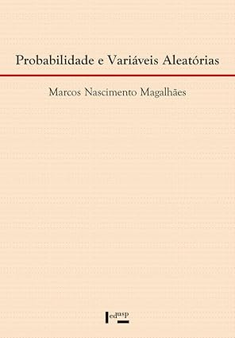
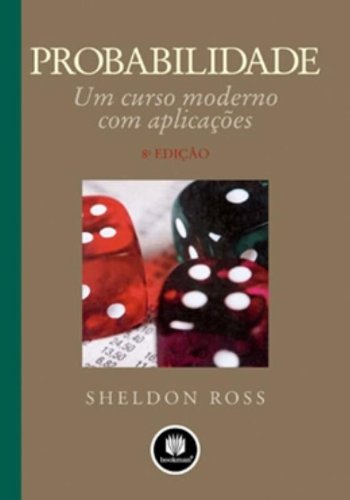
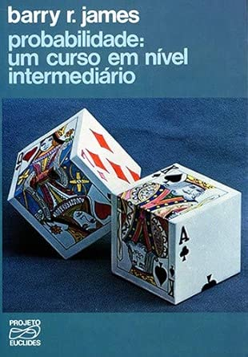

## Por que estudar Probabilidade III?

- Nas disciplinas anteriores, vimos variáveis isoladas. Aqui, estudaremos como elas interagem (Vetores) e para onde elas caminham quando $n \to \infty$ (Convergência).

    - **Objetivo Final:** Provar por que a média de uma amostra realmente converge para a verdade populacional.

---

## Canais de Comunicação e Materiais da Disciplina

- Site: <http://sadraquelucena.github.io/Prob3>

- Grupo no WhatsApp: <http://tiny.cc/prob3wpp>

{fig-align="center"}

---

## Informações da disciplina

- **Componente curricular:** ESTAT0075 -- Probabilidade III
- **Vagas Reservadas:** Estatística
- **Carga horária:** 60 horas (4 créditos)
- **Horário:**
  - Terças -- 19h00 às 20h30
  - Quintas -- 20h45 às 22h15
- **Docente:** Prof. Dr. Sadraque E. F. Lucena

---

## Objetivos

- Capacitar o aluno na utilização e compreensão da teoria probabilística.
- Identificar problemas que requerem o uso de

    - Distribuições condicionadas;
    - Função Característica;
    - Teorema Central do Limite.

---

## Ementa

- Distribuições marginais e condicionais.
- Esperanças condicionais.
- Função geratriz de momentos.
- Função característica.
- Distribuição de funções de variáveis aleatórias.
- Método do Jacobiano e aplicações.
- Sequências de eventos e lema de Borel-Cantelli.
- Convergências de variáveis aleatórias.
- Leis dos Grandes Números.
- Teorema Central do Limite.

---

## Conteúdo programático

1. Variáveis aleatórias n-dimensionais

    1.1. Variáveis aleatórias bidimensionais
    
    1.2. Distribuição Marginal
    
    1.3. Distribuição Condicional
    
    1.4. Esperança e Variância Condicional
    
    1.5. Independência de variáveis
    
    1.6. Distribuições multivariadas

---

## Conteúdo programático

2.  Função Geradora de Momentos e Função Característica

    2.1. Função Geradora de Momentos
    
    2.2. Propriedade das FGM e aplicações
    
    2.3. Função Característica e aplicações
    
    2.4. Propriedades da Função Característica

---

## Conteúdo programático

3. Função de um vetor de variáveis aleatórias

    3.1. Método do Jacobiano
    
    3.2. Distribuições da soma e da diferença de variáveis
    
    3.3. Distribuição do quociente e do produto de variáveis
    
    3.4. Distribuição do Máximo e do Mínimo

---

## Conteúdo programático

4. Convergência e Teorema Central do Limite

    4.1. Desigualdade de Chebychev
    
    4.2. Convergência de variáveis aleatórias
    
    4.3. Convergência em probabilidade e Convergência Quase certa
    
    4.4. Convergência em Distribuição
    
    4.5. Lei dos Grandes Números
    
    4.6. Lei forte e Lei fraca
    
    4.7. Teorema Central do Limite

---

## Bibliografia Recomendada

::: {.columns}
::: {.column width="33%"}

:::
::: {.column width="33%"}

:::
::: {.column width="33%"}

:::
:::

---

## Metodologia

- 2 encontros semanais, com 90 minutos de aula presencial cada
- 30 minutos de atividades extraclasse (hora-trabalho) para cada aula, indicadas pelo docente

---

## Datas Importantes

### Avaliações

- **Avaliação 1:** 12/05/2026 (terça)
- **Avaliação 2:** 16/06/2026 (terça)
- **Avaliação 3:** 14/07/2026 (terça)
- **Avaliação Repositiva:** 16/07/2026 (quinta)

### Não haverá aula

- **02/04/2026:** Quinta-feira santa (recesso acadêmico)
- **21/04/2026:** Tiradentes (feriado nacional)
- **04/06/2026:** Corpus Christi (recesso acadêmico)
- **23/06/2026:** Véspera de São João (recesso acadêmico)

# Relembrando Derivadas e Integrais

---

## Por que revisar derivadas e integrais?

- **Derivadas:** Essenciais para o Método do Jacobiano (Transformação de Variáveis).
- **Integrais:** A ferramenta para calcular Esperanças e Probabilidades em modelos contínuos.
- *Atenção!* Revisar especialmente Integrais de Funções Exponenciais e Logaritmos.

---

## Sobre Derivadas

- **Derivada de uma Constante:** A derivada de qualquer número sozinho é zero. $$f(x) = c \Rightarrow f'(x) = 0$$

- **Regra da Potência:** $$f(x) = x^n \Rightarrow f'(x) = nx^{n-1}$$

---

## Sobre Derivadas

**Derivadas de Funções Exponenciais**

- Exponencial Natural Simples: $$ \text{Se } f(x) = e^x\text{, então: } f'(x) = e^x$$
    
- Exponencial Natural com Regra da Cadeia (Mais comum em estatística): $$ \text{Se } f(x) = e^{u(x)}\text{, então: } f'(x) = e^{u(x)} \cdot u'(x)$$
    
- Exponencial de Base Qualquer ($a$): $$ \text{Se } f(x) = a^x\text{, então: } f'(x) = a^x \log(a)$$

---

## Sobre Derivadas

**Derivadas de Funções Logarítmicas**

- Em estatística é comum usarmos $\log(x)$ para logaritmo natural ao invés de $\ln(x)$.

- Logaritmo Natural Simples: $$ \text{Se }f(x) = \log(x)\text{, então: }f'(x) = \frac{1}{x} $$

- Logaritmo Natural com Regra da Cadeia: $$ \text{Se }f(x) = \log(u(x))\text{, então: }f'(x) = \frac{u'(x)}{u(x)} $$

---

## Sobre Derivadas

**Derivadas de Funções Logarítmicas**

- Logaritmo de Base Qualquer ($a$): $$ \text{Se }f(x) = \log_a(x)\text{, então: }f'(x) = \frac{1}{x\log(a)} $$

---

## Sobre Derivadas

- **Regra da Cadeia:** Usada para funções compostas. Derivamos "de fora para dentro". $$h(x) = f(g(x)) \Rightarrow h'(x) = f'(g(x)) \cdot g'(x)$$

- **Regra do Produto:** $$ (fg)' = f'g + fg'$$
    
- **Regra do Quociente:** $$ \left(\frac{f}{g}\right)' = \frac{f'g -fg'}{g^2}$$

---

## Sobre Derivadas

- **Derivadas Parciais:** Para funções com mais de uma variável (como $x$ e $y$). Derivamos em relação a uma variável e tratamos a outra como constante. Notação: $$\frac{\partial f(x,y)}{\partial x}$$

---

## Exemplo 1.1

Obtenha a derivada das seguintes funções:

a) $f(t) = e^{\lambda(t-1)}$. Calcule $f'(t)$.
b) $f(x) = x^2 \cdot e^{-ax}$. Calcule $\frac{df}{dx}$.
c) $f(z) = e^{-\frac{1}{2}z^2}$. Calcule $f'(z)$.
d) Dada a função $u(x, y) = \frac{x}{x+y}$, calcule $\frac{\partial u}{\partial x}$.
e) Dada $f(x, y) = 7x^2y + 5y^3\log(x)$, calcule as derivadas de primeira ordem $\frac{\partial f}{\partial x}$ e $\frac{\partial f}{\partial y}$.

---

## Sobre Integrais

- **Integral de uma Constante:** $$\int k \, dx = kx + C$$

- **Regra da Potência:** Válido para $n \neq -1$. $$\int x^n \, dx = \frac{x^{n+1}}{n+1} + C$$

- **Caso Especial ($n = -1$):** Quando temos $\frac{1}{x}$, a integral é o logaritmo natural. $$\int \frac{1}{x} \, dx = \log|x| + C$$

---

## Sobre Integrais

**Integrais de Funções Exponenciais**

- Exponencial Natural Simples: $$\int e^x \, dx = e^x + C$$

- Exponencial com Constante no Expoente: Se há uma constante $a$ multiplicando o $x$, ela desce dividindo. $$\int e^{ax} \, dx = \frac{1}{a}e^{ax} + C$$

---

## Sobre Integrais

**Integrais de Funções Logarítmicas**

- **Atenção:** A integral do logaritmo não é $\frac{1}{x}$ (isso é a derivada!).
- A integral de $\log(x)$ é resolvida usando a técnica de Integração por Partes, mas o resultado final é muito útil de se ter em mente: $$\int \log(x) \, dx = x\log(x) - x + C$$

---

## Sobre Integrais

- **Regra da Soma e Subtração:** $$\int [f(x) \pm g(x)] \, dx = \int f(x) \, dx \pm \int g(x) \, dx$$

- **Regra da Constante Multiplicativa:** Constantes "saem" da integral. $$\int c \cdot f(x) \, dx = c \int f(x) \, dx$$

---

## Sobre Integrais

**Integração por Substituição**

- Pense na substituição como o **inverso da Regra da Cadeia**.

- Se definirmos uma função de dentro como $u = g(x)$, a sua diferencial (derivada) será $du = g'(x) dx$. Substituindo na integral, temos:$$\int f(g(x)) \cdot g'(x) dx = \int f(u) du$$

- O objetivo é encontrar uma parte da integral para chamar de $u$, de modo que a derivada dessa parte ($du$) também esteja presente na integral, permitindo trocar todas as variáveis $x$ por $u$. Após integrar em $u$, desfazemos a substituição.

---

## Sobre Integrais

**Integração por Substituição**

- **Quando usar:** Quando identificar uma função "principal" e a derivada do seu "miolo" multiplicando do lado de fora.
- Sinais de que é Substituição:

    - **O grau da variável muda em 1:** Se você tem um $x^2$ dentro de uma raiz ou expoente, e um $x$ do lado de fora. (Ex: $\int x e^{x^2} dx$).
    - **Função e sua derivada estão presentes:** Se você vê um $\ln(x)$ e também vê um $\frac{1}{x}$ na mesma integral. (Ex: $\int \frac{\ln(x)}{x} dx$).
    - **Funções trigonométricas pareadas:** Se você vê um seno e um cosseno juntos. (Ex: $\int \sin^3(x)\cos(x) dx$).

---

## Sobre Integrais

**Integração por partes**

- A integração por partes é o **inverso da Regra do Produto**.
- Se $u$ e $v$ são funções contínuas e diferenciáveis de $x$, então a integral do produto é dada por:$$\int u \, dv = u \cdot v - \int v \, du$$

- Você escolhe uma parte da integral original para ser o $u$ (que você vai derivar para achar $du$) e o restante para ser o $dv$ (que você vai integrar para achar $v$).

---

## Sobre Integrais

**Integração por partes**

- Geralmente as funções dentro da integral não têm nenhuma relação de derivada entre si.
- Sinais de que é por Partes:

    - **Produto de funções de "famílias" diferentes:** Um polinômio multiplicando uma exponencial (Ex: $\int x e^x dx$), ou um polinômio multiplicando uma função trigonométrica (Ex: $\int x^2 \sin(x) dx$).
    - **Funções "solitárias" difíceis de integrar:** Se a integral tem apenas um logaritmo ou uma função trigonométrica inversa sozinha. (Ex: $\int \ln(x) dx$ ou $\int \arctan(x) dx$). Nesses casos, o truque é usar $u = \ln(x)$ e $dv = 1 dx$.

---

## Sobre Integrais

**Integração por partes**

- Em integração por partes você precisa escolher quem é $u$.
- Siga a ordem da sigla **LIATE** para escolher o $u$ (o que vier primeiro na lista ganha):

    - Logarítmicas (ex: $\ln(x)$)
    
    - Inversas trigonométricas (ex: $\arcsin(x)$)
    
    - Algébricas / Polinômios (ex: $x^2$, $3x$)
    
    - Trigonométricas (ex: $\sin(x)$, $\cos(x)$)
    
    - Exponenciais (ex: $e^x$, $2^x$)

---

## Sobre Integrais

**Integrais Duplas**

- Usadas em funções de múltiplas variáveis (ex: densidade conjunta $f(x,y)$).
- Calculamos de "dentro para fora". Integramos primeiro em relação a uma variável (tratando a outra como constante) e depois integramos o resultado.$$\int_{0}^{1} \left( \int_{0}^{1} (x+y) dy \right) dx$$

---

## Exemplo 1.2

Resolva as seguintes integrais:

a) Calcule $\int_{0}^{\infty} e^{-3x} dx$.
b) Calcule $\int x \cdot e^{-x^2} dx$.
c) Calcule $\int_{0}^{\infty} x \cdot e^{-x} dx$.
d) Calcule $\int x^2 \cdot e^{-x} dx$.
e) Dada a densidade conjunta $f(x, y) = c(x+y)$ no domínio $0 < x < 1$ e $0 < y < 1$, calcule a integral dupla $\int_{0}^{1} \int_{0}^{1} (x+y) dy dx$.

# Fim